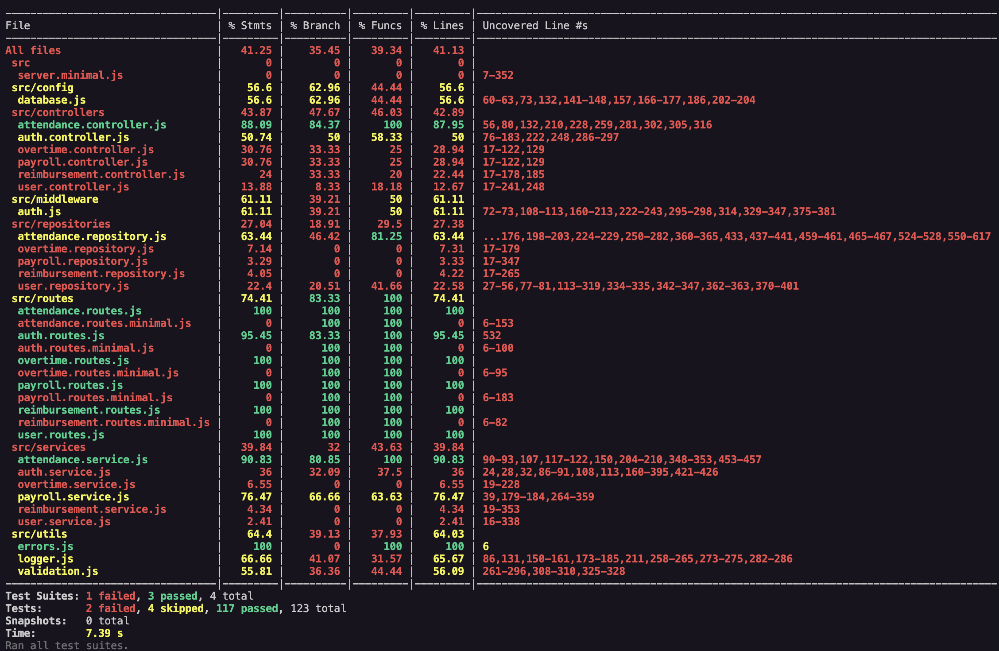

## **How to Run**

### **Prerequisites**
- Node.js (v16 or higher)
- PostgreSQL database

### **Quick Start**
```bash
# 1. Install dependencies
npm install

# 2. Setup environment
cp .env.example .env
# Edit .env with your PostgreSQL credentials

# 3. Setup database
npm run migrate
npm run seed

# 4. Start server
npm run start:minimal

# 5. Open API documentation
open http://localhost:3000/api-docs
```

### **Demo Credentials**
- **Admin**: `admin` / `admin123`
- **Employee**: `employee001` / `emp001pass` (and employee002-employee100)

### **API Testing via Swagger UI**
1. **Open Swagger**: http://localhost:3000/api-docs
2. **Login first**: Use POST `/api/v1/auth/login` with auto-filled demo credentials
3. **Get JWT token**: Copy the `token` from login response
4. **Authorize**: Click **"Authorize"** button at top right
5. **Enter token**: Type `Bearer <your-jwt-token>` (include "Bearer " prefix)
6. **Test APIs**: All endpoints now have **auto-placeholder values** - just click "Execute"!

## **API Usage Guide**

### **1. Authentication**
```bash
# Login as Admin
POST /api/v1/auth/login
{
  "username": "admin",
  "password": "admin123"
}

# Login as Employee
POST /api/v1/auth/login
{
  "username": "employee001",
  "password": "emp001pass"
}
```

### **2. Admin - Create Attendance Period**
```bash
POST /api/v1/admin/attendance-periods
Authorization: Bearer <admin_jwt_token>
{
  "name": "July 2025",
  "start_date": "2025-07-01",
  "end_date": "2025-07-31"
}
```

### **3. Employee - Submit Attendance**
```bash
POST /api/v1/employee/attendance
Authorization: Bearer <employee_jwt_token>
{
  "attendance_date": "2025-06-26",
  "notes": "Regular work day"
}
```

### **4. Employee - Submit Overtime**
```bash
POST /api/v1/employee/overtime
Authorization: Bearer <employee_jwt_token>
{
  "overtime_date": "2025-06-26",
  "hours_worked": 2.5,
  "description": "Project deadline work"
}
```

### **5. Employee - Submit Reimbursement**
```bash
POST /api/v1/employee/reimbursements
Authorization: Bearer <employee_jwt_token>
{
  "amount": 150.75,
  "description": "Travel expenses for client meeting",
  "category": "travel"
}
```

### **6. Admin - Process Payroll**
```bash
POST /api/v1/admin/payroll/process
Authorization: Bearer <admin_jwt_token>
{
  "attendance_period_id": 1
}
```

### **7. Employee - Generate Payslip**
```bash
GET /api/v1/employee/payslip/1
Authorization: Bearer <employee_jwt_token>
```

### **8. Admin - Get Payroll Summary**
```bash
GET /api/v1/admin/payroll/summary/1
Authorization: Bearer <admin_jwt_token>
```

### **Complete Workflow Example**
```bash
# 1. Admin login
curl -X POST http://localhost:3000/api/v1/auth/login \
  -H "Content-Type: application/json" \
  -d '{"username":"admin","password":"admin123"}'

# 2. Employee login
curl -X POST http://localhost:3000/api/v1/auth/login \
  -H "Content-Type: application/json" \
  -d '{"username":"employee001","password":"emp001pass"}'

# 3. Employee submits attendance (repeat for multiple days)
curl -X POST http://localhost:3000/api/v1/employee/attendance \
  -H "Content-Type: application/json" \
  -H "Authorization: Bearer <employee_token>" \
  -d '{"attendance_date":"2025-06-26","notes":"Regular work"}'

# 4. Employee submits overtime
curl -X POST http://localhost:3000/api/v1/employee/overtime \
  -H "Content-Type: application/json" \
  -H "Authorization: Bearer <employee_token>" \
  -d '{"overtime_date":"2025-06-26","hours_worked":2,"description":"Extra work"}'

# 5. Employee submits reimbursement
curl -X POST http://localhost:3000/api/v1/employee/reimbursements \
  -H "Content-Type: application/json" \
  -H "Authorization: Bearer <employee_token>" \
  -d '{"amount":100,"description":"Travel cost"}'

# 6. Admin processes payroll
curl -X POST http://localhost:3000/api/v1/admin/payroll/process \
  -H "Content-Type: application/json" \
  -H "Authorization: Bearer <admin_token>" \
  -d '{"attendance_period_id":1}'

# 7. Employee generates payslip
curl -X GET http://localhost:3000/api/v1/employee/payslip/1 \
  -H "Authorization: Bearer <employee_token>"

# 8. Admin gets summary
curl -X GET http://localhost:3000/api/v1/admin/payroll/summary/1 \
  -H "Authorization: Bearer <admin_token>"
```

### **Testing Commands**
```bash
# Run all tests
npm test

# Run unit tests only
npm run test:unit

# Run integration tests only
npm run test:integration

# Test with coverage
npm run test:coverage
```

